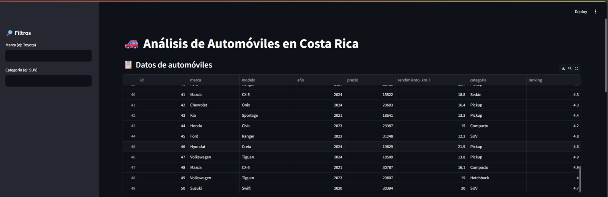
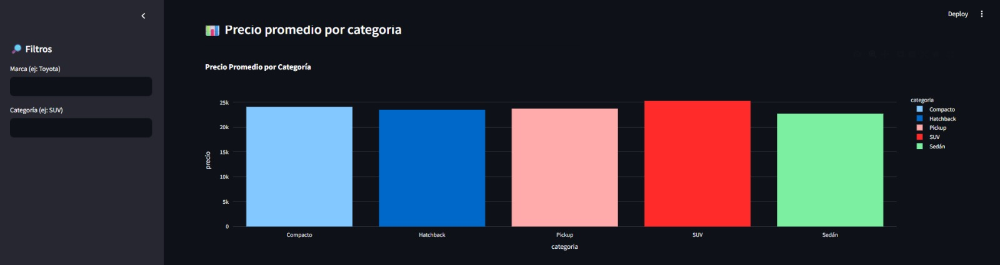
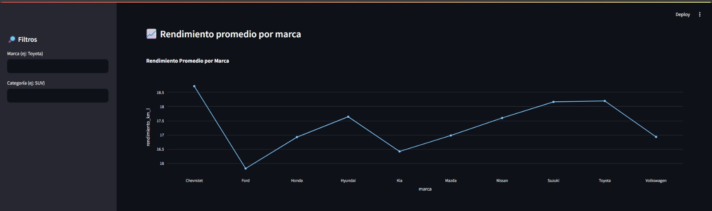
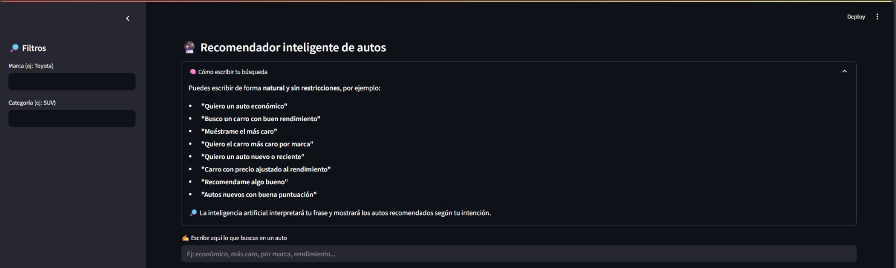
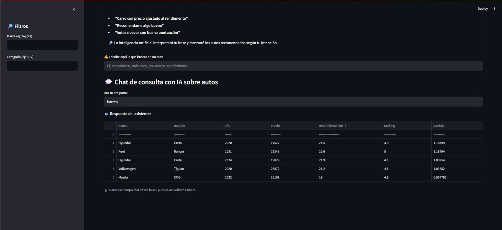

# 🚗 Web_Consumiendo_Api_Autos

Aplicación interactiva desarrollada con **Streamlit** que permite consultar, visualizar y recibir recomendaciones inteligentes de automóviles en Costa Rica. Utiliza una API pública y una integración con **inteligencia artificial (IA)** mediante [OpenRouter.ai](https://openrouter.ai/) para interpretar preguntas escritas en lenguaje natural.

---

## 🔍 Funcionalidades principales

- 📋 **Catálogo de autos en tiempo real** desde una API propia
- 📊 **Gráficas interactivas** por marca, rendimiento y año
- 🧠 **Recomendador inteligente** basado en preferencias como:
  - Autos económicos
  - Buen rendimiento
  - Carros recientes o top ranking
  - El más caro por marca, etc.
- 💬 **Chat con IA gratuita (OpenRouter)** que interpreta frases como:
  - "Quiero un auto barato y que rinda mucho"
  - "Muéstrame los autos nuevos con buen ranking"
  - "Carro costoso por marca"
- 📥 **Descarga de autos recomendados** en Excel

---

## 🧰 Tecnologías utilizadas

| Herramienta | Uso |
|-------------|-----|
| [Streamlit](https://streamlit.io/) | Interfaz web interactiva |
| [Pandas](https://pandas.pydata.org/) | Manejo de datos |
| [OpenRouter.ai](https://openrouter.ai/) | IA para interpretar preguntas |
| [Python 3.10+](https://www.python.org/) | Lenguaje base |
| `requests`, `xlsxwriter`, `tabulate` | Dependencias adicionales |

---

## ⚙️ Cómo ejecutarlo localmente

1. **Cloná el repositorio:**

```bash
git clone https://github.com/DevWilliamCN/Web_Consumiendo_Api_Autos.git
cd Web_Consumiendo_Api_Autos
```

2. **Instalá las dependencias:**

```bash
pip install -r requirements.txt
```

3. **Agregá tu clave de OpenRouter en un archivo `.env`:**

```env
OPENROUTER_API_KEY=sk-or-XXXXXXXXXXXXXXXXXXXXXX
```

4. **Ejecutá la app:**

```bash
streamlit run app.py
```

---

## 🌐 Despliegue en línea

Podés publicarla fácilmente en [Streamlit Cloud](https://streamlit.io/cloud):

- Repositorio: ✅ Este proyecto
- Archivo principal: `app.py`
- Variables de entorno: agregá tu `OPENROUTER_API_KEY` como secreto

---

## 📸 Captura



### 📊 Gráficas interactivas



### 🧠 Recomendador inteligente



### 💬 Chat con IA (natural language)



### 📥 Exportar a Excel




---

## 📄 Licencia

MIT © William Cubero Navarro – 2025  
¡Usalo, modificá y compartí libremente!

---

## 🤖 Créditos

Este proyecto integra IA sin costo mediante [OpenRouter.ai](https://openrouter.ai), usando modelos gratuitos como `mistralai/mistral-7b-instruct:free`.

---
